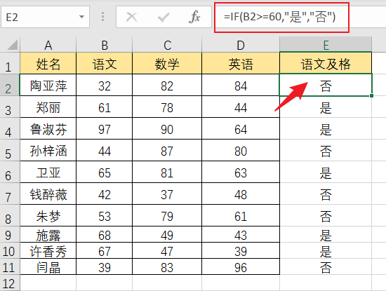
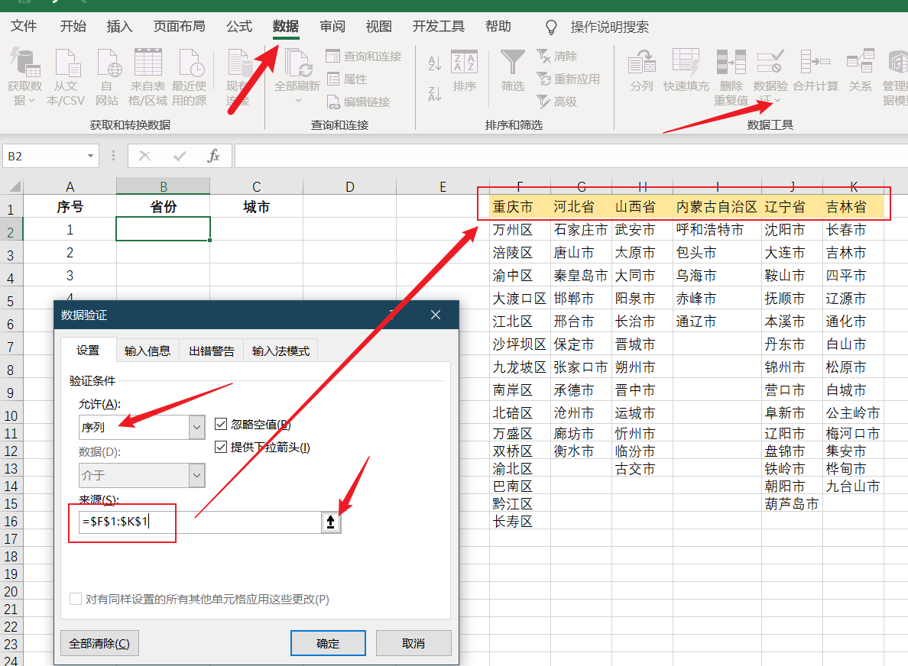
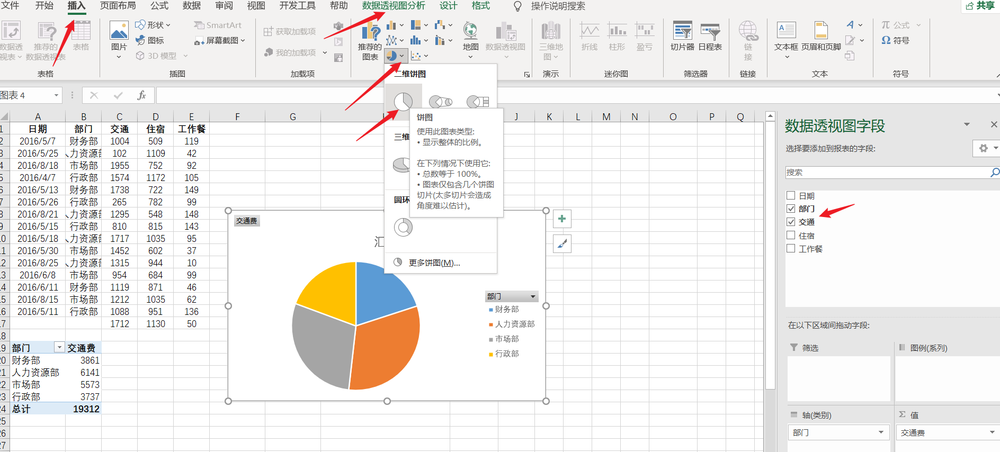

# Excel 数据处理和分析基础

该手册内容包括 Excel 基本的数据操作、运算、函数应用以及可视化。

## 数据引用

数据引用是数据运算和函数应用的基础，如何引用数据呢？

左边的一列数字编号我们称为行号，上端的一行字母我们称为列号。

整行引用 `行号:行号`：

整列引用 `列号:列号`：

单个数据引用 `列号行号`：

整块数据引用 `列号行号:列号行号`：

**注意**：上面的引用都是相对引用，会随着引用点变化而变化。例如，`B2:C8` 向下拖动就变成 `B3:C9`：

如何进行绝对引用？

锁住列 `$列号行号`，拖动引用点，列号不会变，行号随行数增减，所以行的数据会变化：

锁住行 `列号$行号`，拖动引用点，行号不会变，列号随列数增减，所以列的数据会变化：

行列都锁住 `$列号$行号`，拖动引用点，行、列号都不变：

## 运算符

Excel 的运算符有数学运算符，包括 `+`、`-`、`*`、`/`、`^`，含义依次为加、减、乘、除、幂；比较运算符，包括：`=`、`>`、`<`、`>=`、`<=`、`<>`，含义依次为等于、大于、小于、大于等于、小于等于、不等于，它们的作用以比较两个值，结果为一个逻辑值，结果为真是 “TRUE” 否则就是 “FALSE”。

直接计算算式的值：

各个单元格之间计算：

比较两个数的大小：

## Excel 常用函数

Excel 的函数非常多，要查看所有函数访问官网：https://support.microsoft.com/zh-cn/office/excel-%E5%87%BD%E6%95%B0-%E6%8C%89%E5%AD%97%E6%AF%8D%E9%A1%BA%E5%BA%8F-b3944572-255d-4efb-bb96-c6d90033e188

我们下面介绍一些非常常用的函数。

## 求和函数

SUM 函数将值相加。 你可以将单个值、单元格引用或是区域相加，或者将三者的组合相加。例如：`=SUM(A2:A10)` 将单元格 `A2:10` 中的值加在一起。`=SUM(A2:A10, C2:C10)` 将单元格 `A2:10` 以及单元格 `C2:C10` 中的值加在一起。

还可以通过相对引用和绝对引用的不同，来实现不一样的求和，例如下面的每日求和和累计求和：

SUMIF 函数用于条件求和。`=SUMIF(A1:A10,">60")` 统计 `A1:10` 中大于 60 的数的和：

分别求出甲、乙的业绩总和：

## 逻辑函数

AND 函数用于确定所有条件是否都是真（TRUE）；OR 函数确定所有条件是否至少有一个是真。

例如下列判断成绩是否都及格，或至少一门及格：

IF 函数用来确定条件满足与否的情况下分别给出结果。`=IF(条件,结果1,结果2)`，假如 `条件` 为真，就是 `结果1`，否则 `结果2`：

还可以多个函数一起灵活使用：

实用案例，按照薪资规定计算各位员工的薪资：

## 计数函数

计数函数有 COUNT（统计数字） COUNTA（统计非空） COUNTBLANK（统计空） COUNTIF（统计满足条件）等。下面以非常小的数据量举例：

从统计结果我们可以得到男生 3 人；被打分人数是 5，打分数字数是 4，说明打分栏数字格式不统一；没有被打分的有 2 个。

如果数据量很大，通过统计，我们可以对数据进行处理。例如统一数据格式，填充空值或删除空值等。

## 日期函数

TODAY 函数返回当前日期；EOMONTH 函数返回在指定日期上指定月数之前或者之后的最后一天；DATEDIF 函数返回两个日期之间的天数、月份或者年数。

## 文本处理函数

LEFT 截取左边 N 个字符；RIGHT 截取右边 N 个字符；REPLACE 替换字符。

## 查找与引用函数

- VLOOKUP 函数：

`=VLOOKUP (要查找的项,要查找的区域,区域中包含要返回的值的列号,近似匹配或精确匹配)`。

VLOOKUP 函数用于按行查找表格或区域的内容。使用灵活而强大，可以使用 VLOOKUP 将多个表合并为一个表，只要其中一个表具有与其他所有表通用的字段。

下面我们举一个简单的例子：下图中 `=VLOOKUP(C3,F:G,2,0)`，`C3` 要查找的项，`F:G` 要查找的区域，`2` 查找区域中包含返回值的列是第 2 列，`0` 精确匹配（1 则是近似匹配）。

- MATCH 函数：

在指定区域中搜索特定的项，然后返回该项在此区域中的相对位置：例如下图中 `=MATCH(C1,$A$1:$A$7,0)`，`C1` 要搜索的项，`$A$1:$A$7` 指定区域，`0` 精确匹配。

- INDEX 函数：

返回指定区域中，指定位置（在指定区域中的位置）的数据：例如下图中 `=INDEX($A$2:$A$4,D9)`，`$A$2:$A$4` 指定区域，`D9` 指定的位置（D9 对应的数 2），位置在指定区域中为 2，级别与位置一一对应，位置 2 的级别也是 2，所以结果是 `5000`。

- OFFSET 函数：

以指定的引用为参照系，通过给定偏移量得到新的引用。返回的引用可以为一个单元格或单元格区域。并可以指定返回的行数或列数。

下面我们以引用一个区域中 “5 行 3 列的子区域” 为例：先在空白区域选择 5 行 3 列，然后输入 `=OFFSET(B7,2,2,5,3)`，`B7` 引用点，第一个 `2` 向下偏移量，第二个 `2` 向右偏移量，后面的表示引用 5 行 3 列。

然后按快捷键 `Ctrl + Shift + Enter`，就以引用点 B7 为基础，得到新的引用啦（上面输入的公式会自动被花括号包围）：

- INDIRECT 函数：

返回由文本字符串指定的引用。例如 `=INDIRECT("B3")` 返回 `"B3"` 指定的引用；`=INDIRECT(C2)` 中 `C2` 不是文本字符串，而是一个单元格，所以返回 `C2` 格中的字符串 `"B2"` 指定的引用。

利用 INDIRECT 函数制作多级联动下拉菜单：选择 `省份` 下第一格，点击 `数据`，`数据验证`，`数据验证`，验证条件选 `序列`，`来源` 选中所有省份，`确定`，省份一列从第一格下拉即可：

定义名称：按快捷键 `Ctrl + F3` 打开名称管理器，点击 `新建`，名称栏输入 `重庆市`，引用位置选中重庆市下面所有，点击 `确定`。

同样的操作，将其他省份的名称也定义完。

选中 `城市` 下第一格，点击 `数据`，`数据验证`，`数据验证`，验证条件选 `序列`，`来源` 输入 `=INDIRECT(B2)`，`确定`，城市一列从第一格下拉即可：

然后就可以省份一列选择省份，城市一列对应只能选该省下的城市啦：

Excel 函数灵活组合应用，可以大大提高数据处理、分析效率，以及数据展示、可视化的效果等。

## 数据透视表简介

数据透视表的功能非常强大，数据汇总、处理、分析、展示快速高效。很多情况都比使用函数计算要高效许多。

下面简单介绍数据透视表的使用：按照部门统计各项费用的使用情况。

选中数据，点击 `插入`，`数据透视表`，`表格和区域`：

接着选择 `现有工作表`（也可以选 `新工作表`，这样透视表将在新表中生成），`位置` 选择下方没有数据的任意空格，点 `确定`：

我们是按照部门汇总分析，所以将 `部门`，`交通`，`住宿`，`工作餐` 都勾选上，透视表就自动生成啦：

简简单单几步，所有部门的各项费用汇总表就出来了。你还可以尝试将各个字段在不同的区域间随便拖动，看看有何变化；或者对字段进行不同的设置在看看呢？

我们看看**各个部门交通费的使用占比情况**：只选择 `部门` 和 `交通费` 两个字段，点击 `插入`，`数据透视图分析`，选择饼图：

鼠标放在饼图上，右击，选择 `添加数据标签`：

鼠标放在饼图上，右击，选择 `设置数据标签格式`：

按照下图箭头所指勾选，也可以尝试勾选其他选项看看效果：

## 可视化

- 柱状图

看看小米 19 年销量排名：选择数据，点击 `插入`，选择柱状图，鼠标放在柱状图上右击，点击 `添加数据标签`；点击小米上方的柱状图，只选择它一个柱子，右击，`填充`，选择颜色即可得到下面样式的图表：

- 折线图

查看各个平台交易增长情况：选择数据，点击 `插入`，选择 `带数据标记的折线图`，即可得到下面的图表，能够很直观的看到各个平台增长情况，和清晰的对比：

- 饼图

看看 19 年各品牌电脑销量占比情况：选择数据，点击 `插入`，选择饼图，在饼图上右击，选择 `添加数据标签`，再右击，选择 `设置数据标签格式`，按下图勾选设置，即可得到下图，也可以尝试其他选项：

- 散点图

看看拉新投入与新增用户数之间的关系：选择数据，点击 `插入`，选择散点图，鼠标放在点上，右击，选择 `添加趋势线`，选择适合的趋势线，按箭头所指勾选，即可得到下图。拉新投入与新增用户数明显正相关：

- 箱型图

看看各个电脑品牌，各个季度销量对比：选择数据，点击 `插入`，`推荐的图表`，`所有图表`，选择 `箱型图`，然后点击生成的图表右上方的 `+` 号，勾选 `图例`，将图例放出来，鼠标放在箱体上，右击，选择 `设置数据系列格式`，将 `间隙宽度` 调小，即可得到下图。联想销量各个季度都很高，波动也不大，明显好于其他品牌：

---

Excel 数据处理和分析基础就简单介绍到这里，祝您早日成为 “表哥”，“表姐”，“表弟” 或 “表妹” 大神。